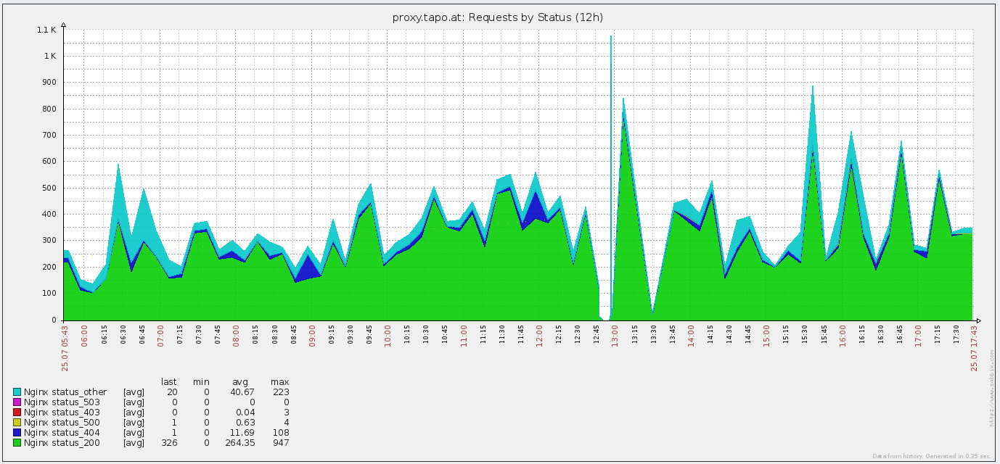

zabbix-nginx-stats
==================

Simple access log parsing for zabbix (tested with nginx). - written in perl and a wrapper bash script.

Installation/Configuration:
----------------

### checkout from github
### install dependencies

* Perl
* Statistics::Descriptive, Date::Parse and File::Temp
    * for debian: install packages libstatistics-descriptive-perl libtimedate-perl

### configure logfile output:

         log_format timed_combined '$remote_addr $host $remote_user [$time_local]  '
                    '"$request" $status $body_bytes_sent '
                    '"$http_referer" "$http_user_agent" $request_time $upstream_response_time $pipe';

### Import template zbx_template_nginx.xml
### configure crontab to run every 10 minutes:

    8-59/10 * * * *   root      /home/scripts/zabbix-nginx-stats/zabbix-nginx-stats-runner.sh

### watch results coming in.

